# 1541-II-low-profile-rom-switcher
* [Overview](#overview)
* [Hardware](#hardware)
   * [PCB Manufacturing](#pcb-manufacturing)
   * [BOM](#bom)
   * [Assembly](#assembly)
* [Programming The Board](#programming-the-board)
   * [Hardware](#hardware-1)
   * [Software](#software)
* [Programming The 27c512](#programming-the-27c512)
* [Installation](#installation)
   * [Reset Line (C64)](#reset-line-c64)
   * [Testing Cut Pins](#testing-cut-pins)
   * [Reset Line (1541-II)](#reset-line-1541-ii)
* [Debugging](#debugging)

## Overview
The 1541-II low profile rom switcher is designed to work in conjunction with [bwack](https://github.com/bwack)'s [SKS64](https://github.com/bwack/C64-Switchless-Multi-Kernal-27C256-adapter/) switchless kernel rom switcher for the C64.  SKS64 does have support for running in a 1541-II disk drive. However I found for my 1541-II it's not possible to use because its way to tall and gets in the way of the drive motor.

Thus I decided to make the low profile 1541-II board.  Here you can see the difference in height between them.

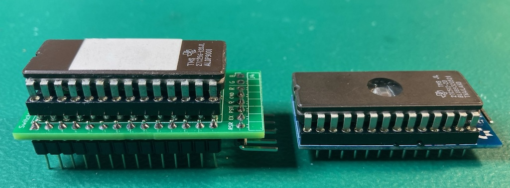

Board pics / Assembled
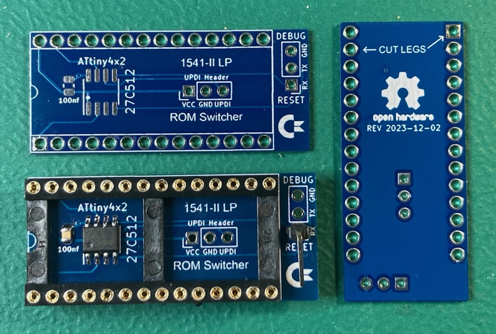

In order for the low profile board to work we need to take control of A14 (PIN 27) and A15 (PIN 1) on the 27c512 ROM.  These are normally tied to VCC on the 1541-II board.  To do this we cut these legs from the socket used on the low profile board to prevent them connecting to the 1541-II board.  This allows the ATtiny402 MCU to control those address lines on the 27c512 eprom for switching between kernels.

There are a few difference between the low profile board and SKS64 shortboard for use in a 1541-II.

  * Support for 4 kernels (SKS64 is hardcoded for 2)
  * NO LED support
  * Debug serial port
  * ATtiny 4x2 MCU (SKS64 uses ATtiny45/85)
  * Removal of Restore / EXROM pins (not needed in 1541-II)

## Hardware
#### PCB Manufacturing
You will want to pick **1.0mm PCB thickness** instead of the default of 1.6mm.  A 1.6mm thick PCB will make the legs a little to short and cause it to not be fully secure in the rom socket.

I've been using [jlcpcb](https://jlcpcb.com/) for PCB manufacturing.  Watch out as by default they will add an order number to the silk screen unless you tell them not to.

#### BOM
| Description | Part Number | DigiKey | Mouser | Notes |
|-------------|-------------|---------|--------|-------|
| ATtiny402 20Mhz | ATTINY402-SSN | [ATTINY402-SSN-NDD](https://www.digikey.com/en/products/detail/microchip-technology/ATTINY402-SSN/9947535) | [579-ATTINY402-SSN ](https://www.mouser.com/ProductDetail/Microchip-Technology/ATTINY402-SSN?qs=3HJ2avRr9PLRpVpK36KNsg%3D%3D) | Other ATtiny tinyAVR 0/1/2-series models should be viable as well.  The code compiles to a little under 2K in size.  So, it should be viable to use a ATtiny 2x2 model, but I've only tested with a 402 |
| 100nf / 0.1uf 50V SMD Ceramic Capacitor 0805 Size | CL21B104KBCNNNC | [1276-1003-2-ND](https://www.digikey.com/en/products/detail/samsung-electro-mechanics/CL21B104KBCNNNC/3886661)| [187-CL21B104KBCNNNC](https://www.mouser.com/ProductDetail/Samsung-Electro-Mechanics/CL21B104KBCNNNC?qs=349EhDEZ59pEfpnm5yBEmQ%3D%3D) | Other models should be fine with the same size/specs |
| 28 Pin Dip Machine Socket | ICM-628-1-GT-HT | [2057-ICM-628-1-GT-HT-ND](https://www.digikey.com/en/products/detail/adam-tech/ICM-628-1-GT-HT/9832982) | ?? | The specific part number isn't required, but it must be a machined 28 pin dip socket with the cross members in the same locations as seen in the picture at the top of this page. This [part](https://www.aliexpress.us/item/2251832711755702.html) (28pin wide) from Aliexpress also works |
| 27c512 eprom | | | | Not sure if there is a speed requirement, I've been using 120ns |
| 1x right angle IDC jumper pin | | | | |

#### Assembly
The first thing you should do is a test fit of the socket into the low profile PCB.  I came across a couple PCBs in a batch that didn't fit and wasn't until after I had soldered the SMD components that I found this out.

As you can see in the first socket in the picture below the pins start out wide then go skinny.  Normally the wide part is used to keep the socket up off a board, however the low profile PCB has extra wide through holes to allow it to sit flush with the plastic part of the socket.  Doing this allows the pins from the socket to be long enough to fit properly into the rom socket on the 1541-II board.

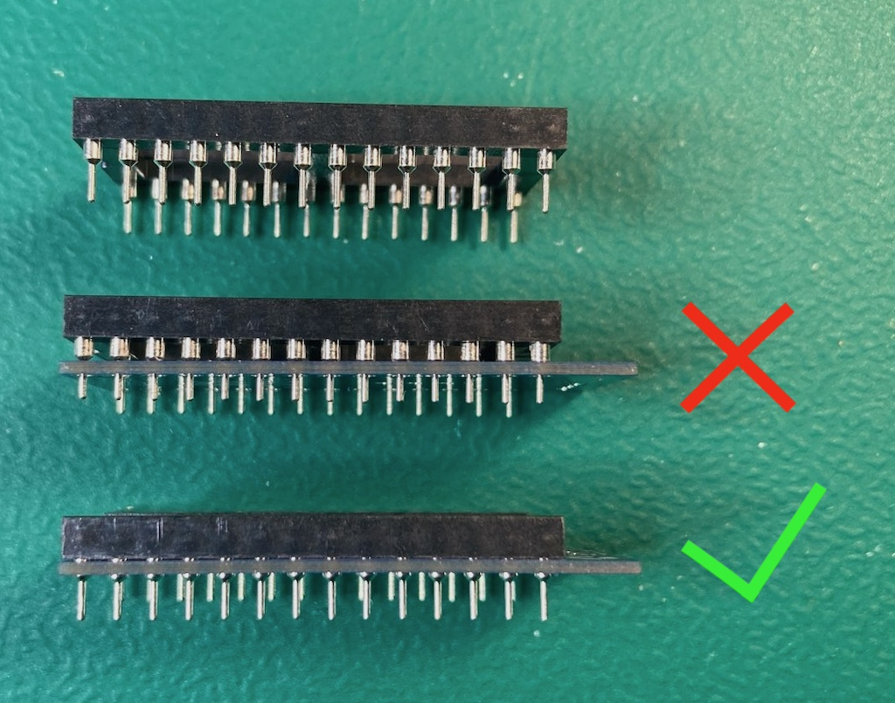

You should solder the SMD components first.  Take special care to void getting any solder into any of the socket through holes.

When soldering the socket its best to not use a ton of solder.  The below picture is a board where the socket hasn't been soldered in yet.

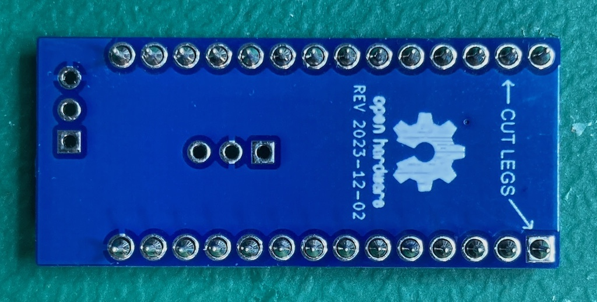

Note the small gap between the through holes and socket pins.  Solder will naturally want to wick up into that gap.  I generally just use enough solder so that the gap around the socket pin becomes filled.

Once you have completed soldering the socket you should check the skinny part of the pins to verify there aren't any solder blobs on them.  These could cause damage to the rom socket.

You will then want to cut the skinning part of the legs on the pins the arrows are pointing at on the underside of the low profile board as seen below.

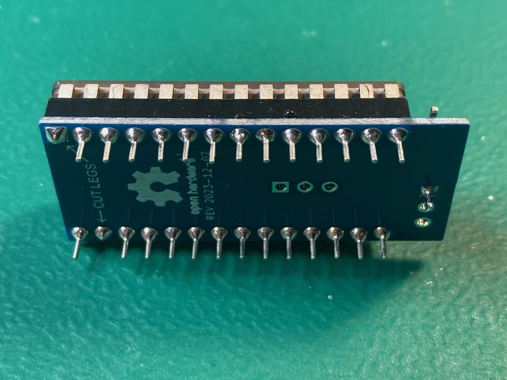

Install the single right angle IDC jumper pin into the RESET/RX through hole so its pointing towards the commodore logo as seen in the picture at the top of this page.

## Programming The Board
#### Hardware
Programming is done with a UPDI programmer.  I've been using this one:

[Serial UPDI Programmer for ATmega 0-Series, or ATtiny 0-Series or 1-Series, or AVR DA or AVR DB](https://www.amazon.com/dp/B09X64YRLD?psc=1&ref=ppx_yo2ov_dt_b_product_details)

Note: This programmer (and likely others) has a switch for 3.3V and 5V.  Set it to 5V.

The rom switcher programming port is setup so you can wedge the pins from the above programmer directly into them to programming.

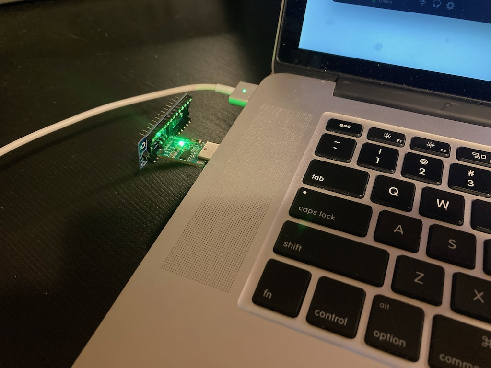

Of course be sure you properly orient the board so the labeled pin/holes match up.  vcc to vcc, gnd to gnd, and updi to updi.

#### Software
For software I've been using the [Arduino IDE](https://www.arduino.cc/en/software/OldSoftwareReleases) with [megaTinyCore](https://github.com/SpenceKonde/megaTinyCore), which adds support for tinyAVR 0/1/2-Series MCUs.

**NOTE**: The makers of megaTinyCore currently recommend using Arduino IDE version 1.8.13 for best compatibility.  2.0 definitely does not work!

To install the megaTinyCore you, should just need to add http://drazzy.com/package_drazzy.com_index.json to "Additional Boards Manager URLs" in the settings for the Arduino IDE.

From there you need to configure the board/programming settings.  I've been using these:

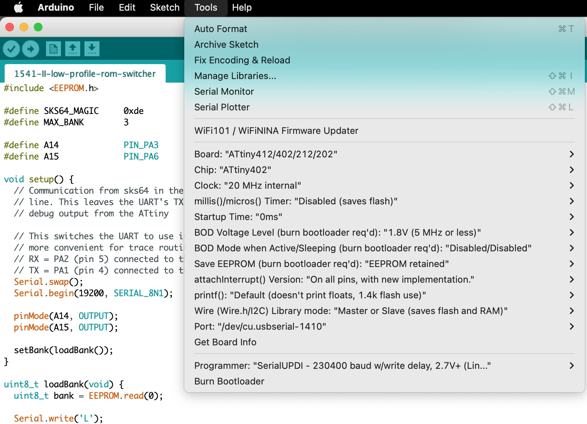


## Programming The 27c512
The low profile board expects a 27c512 eprom, which 64KB in size.  The kernel size of the 1541-II is 16KB, thus 4 banks (0 to 3) are support.

When the SKS64 switches to a new bank on the C64 it will send the selected bank number to the 1541-II board (using serial over the RESET line).  The low profile firmware will use this bank number to select the corresponding bank in the 27c512 eprom.

Things to consider with the SKS64 in the C64:

  * Longboard version with a 27c256 supports 4 banks (0 to 3)
  * Longboard version with a 27c512 supports 8 banks (0 to 7)
  * Shortboard version with a 27c256 supports 3 banks (1 to 3)
  * Shortboard version with a 27c512 supports 7 banks (1 to 7)

In the case where the low profile board is told to change to bank 4+ it will default to just picking the 3rd bank.  If you want a different behaviour you can tweak the firmware.

You will note that the shortboard versions of the SKS64 starts at bank 1 instead of 0.  In this case the low profile board will never use whatever kernel is placed into bank 0 of the 27c512, since SKS64 will never send 0.  You should take this in to account when setting up your 27c512 eprom.

```
dos> copy /b bank0_kernel.bin + bank1_kernel.bin + bank2_kernel.bin + bank3_kernel.bin low_profile_27c512.bin

linux $ cat bank0_kernel.bin bank1_kernel.bin bank2_kernel.bin bank3_kernel.bin > low_profile_27c512.bin
```

Then program your low_profile_27c512.bin to your 27c512 eprom.

## Installation
#### Reset Line (C64)
Some C64 models have a segmented RESET signals for internal (INTRES) and external (EXTRES).  The latter goes to the disk drive and only seems to trigger during a power up of the C64.  This prevents the SKS64 in the C64 from sending its rom switch command to the disk drive.

To work around this is possible to connect the INTRES and EXTRES lines together, so when the SKS64 in the C64 sends its rom switch command to the INTRES line it will also goto the EXTRES.


| C64 MODEL       | HAS SEGMENTED RESET   | WORK AROUND |
|:---------------:|:---------------------:|-------------|
| 326298 (long)   |         NO            | Not Needed  |
| 250407 (long)   |         NO            | Not Needed  |
| 250425 (long)   |        YES            | ?? / don't own this model |
| 250466 (long)   |        YES            | ?? / don't own this model |
| 250469 (short)  |        YES            | Bridge PIN 2 and 6 on U22 (7406N) |


#### Testing Cut Pins
Once you have the low profile board installed in the kernel rom socket you will want to verify the cut pins are not making contact with the underlying socket on the 1541-II board.

Use a multimeter on continuity mode and verify there is no continuity between PIN 28 (VCC) and the cut pins (PIN 1 and PIN 27).

#### Reset Line (1541-II)
SKS64 in the C64 communicates to the low profile board over the RESET line to tell it which 1541-II kernel rom to switch it.

There are a few places you can tap the RESET line, but the one below seems to be easiest.

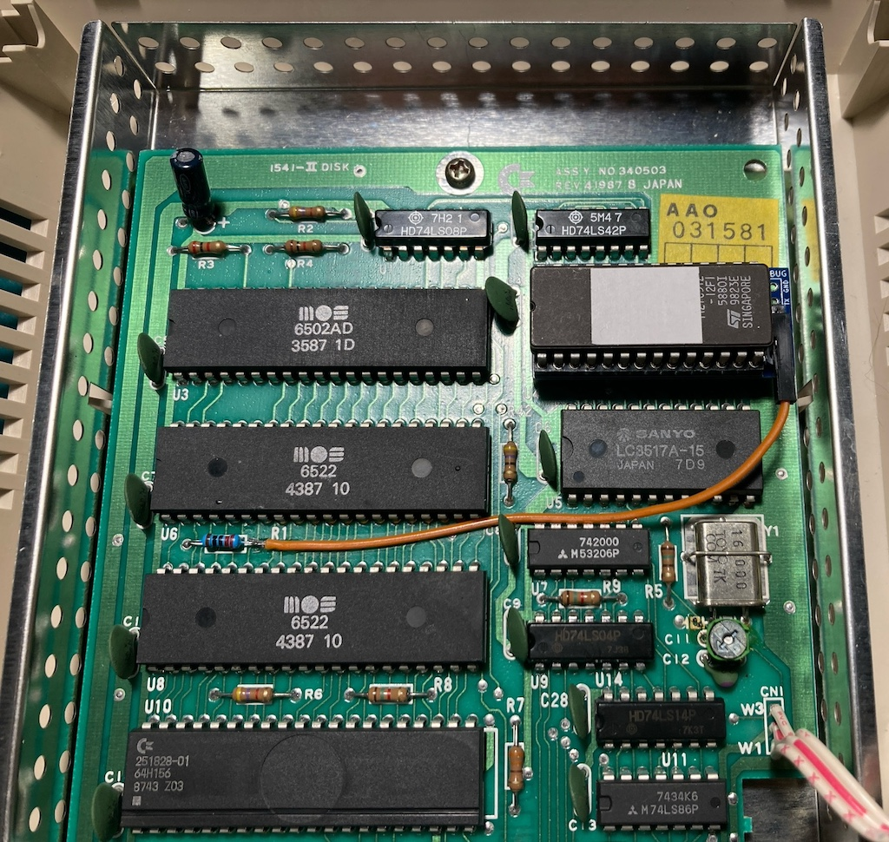

Additionally I'm using the green disc capacitor to help hold the wire down.


## Debugging
The communication between the SKS64 in the C64 and the low profile board is one way, leaving the TX line of the ATtiny's UART available for debug output.

All you should need is a dumb usb to serial device like the one below.
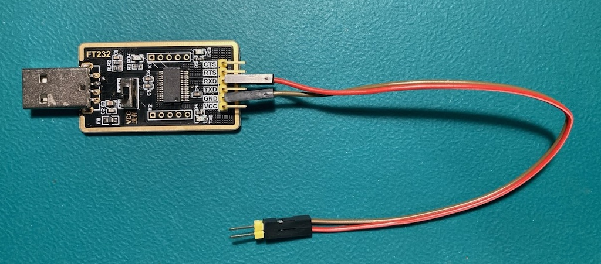

The usb to serial device needs to have its RX connected to the low profile board's TX through hole and its GND to GND.

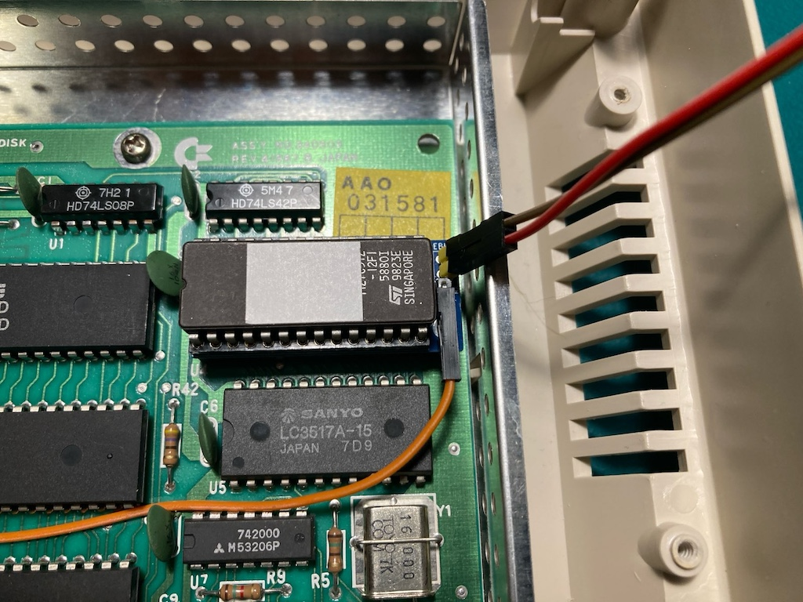

This connection does not need to be soldered, just have it at an angle so the pins are touching the side of the through holes.

From there you need to use a serial program connected at 19200 baud.  The arduino IDE has one built it, and is what I use.

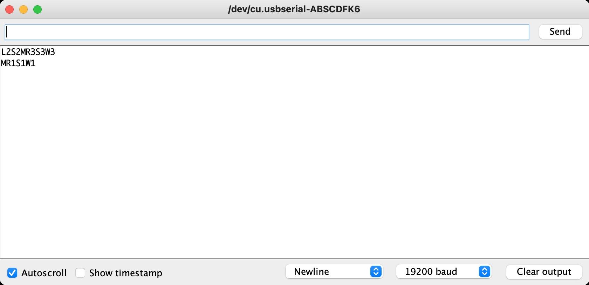

I kept the debug output short as I was trying to keep the total firmware size under 2k, so its possible to use an ATtiny 2x2 instead of the 4x2.

These are what the debug values mean.

```
Ln  = At power up read 'n' from ATtiny's EEPROM indicating the last used rom bank
Sn  = Switched to rom bank 'n'
Wn  = Wrote 'n' to ATtiny's EEPROM
M   = Received magic byte (0xde) from SKS64
Rn  = Received request to switch to rom bank 'n' from SKS64
```
